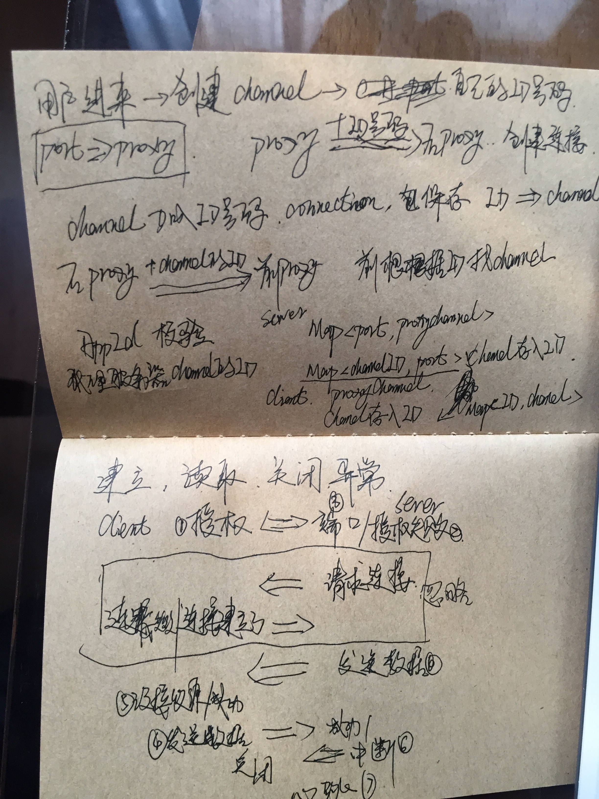

# proxy-demo
proxy-demo

想法错了，这应该是正确的流程，有时间实现

内网穿透和那个option是没关系的

节点

1. [x] 不正确的流程
2. [ ] 正确流程的实现
3. [ ] 与nginx-lua的结合
4. [ ] 提供api访问

## 一对多的链接
一个客户端代理的端口可以有多个访问
支持同一个appid不同的代理端口请求服务端

### 服务端启动
``
java -cp proxy-demo-0.0.1-SNAPSHOT.jar cn.blmdz.proxy.server.ServerContainer 0.0.0.0:port
``

    0.0.0.0 -> 绑定本地的ip
    port -> 对外提供的端口

### 客户端启动
``
java -cp proxy-demo-0.0.1-SNAPSHOT.jar cn.blmdz.proxy.client.ClientContainer babababa server.com:port 0.0.0.0:port
``

    babababa -> appid唯一标识
    server.com -> 服务端地址
    port[0] -> 服务端暴露的端口
    0.0.0.0 -> 绑定本地的ip
    port[1] -> 需要代理的端口

